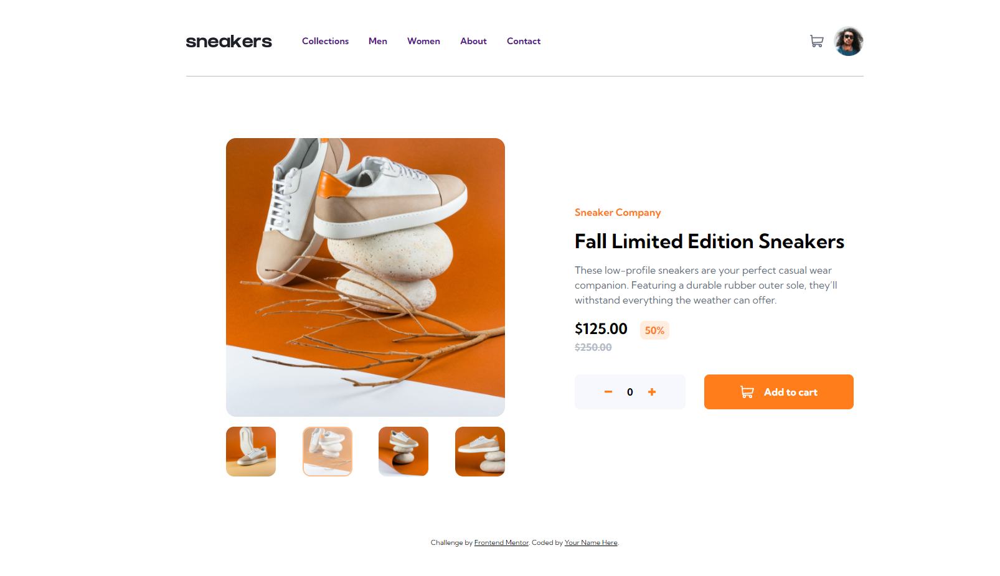

# Frontend Mentor - E-commerce product page solution

This is a solution to the [E-commerce product page challenge on Frontend Mentor](https://www.frontendmentor.io/challenges/ecommerce-product-page-UPsZ9MJp6). Frontend Mentor challenges help you improve your coding skills by building realistic projects.

## Table of contents

- [Overview](#overview)
  - [The challenge](#the-challenge)
  - [Screenshot](#screenshot)
  - [Links](#links)
- [My process](#my-process)
  - [Built with](#built-with)
  - [What I learned](#what-i-learned)
  - [Continued development](#continued-development)
  - [Useful resources](#useful-resources)
- [Author](#author)

## Overview

### The challenge

Users should be able to:

- View the optimal layout for the site depending on their device's screen size
- See hover states for all interactive elements on the page
- Open a lightbox gallery by clicking on the large product image
- Switch the large product image by clicking on the small thumbnail images
- Add items to the cart
- View the cart and remove items from it

### Screenshot

### Links

- Solution URL: [https://github.com/simplyJC/ecommerce-product-page-main](https://github.com/simplyJC/ecommerce-product-page-main)
- Live Site URL: [https://silly-villani-d8d136.netlify.app/](https://silly-villani-d8d136.netlify.app/)

## My process

### Built with

- Semantic HTML5 markup
- CSS custom properties
- Flexbox
- CSS Grid
- Mobile-first workflow
- Vanilla JS

### What I learned

I learned how to set dataset active in Javascript as an indicator that the item will be shown. It is a bit tricky but I manage to show image when user click next or select thumbnail. I learned how to utilize DOM. Adding items is also one thing I learn and tracking how many items added.  

### Continued development

Vanilla Javascript is still a challenge for me. I am struggling in building the lightbox and image slider. The best way for me to learn is to code everyday and understand how thing works especially in manipulating DOM, arrays and datasets. 

### Useful resources

- [https://www.youtube.com/watch?v=9HcxHDS2w1s](https://www.youtube.com/watch?v=9HcxHDS2w1s) - This helped me in building Slider. 
- [https://www.youtube.com/watch?v=uKVVSwXdLr0&list=LL&index=1&t=610s](https://www.youtube.com/watch?v=uKVVSwXdLr0&list=LL&index=1&t=610s) - This is an amazing tutorial for Lightbox

-[https://www.youtube.com/watch?v=UcrypywtAm0&list=LL&index=3&t=1912s](https://www.youtube.com/watch?v=UcrypywtAm0&list=LL&index=3&t=1912s) - Best tutorial for Creating a shopping Cart. 

## Author

- Website - [SimplyJC](https://www.simplyjc.com)
- Frontend Mentor - [@simplyJC](https://www.frontendmentor.io/profile/simplyJC)
- Twitter - [@jcaltamia](https://twitter.com/jcaltamia)

